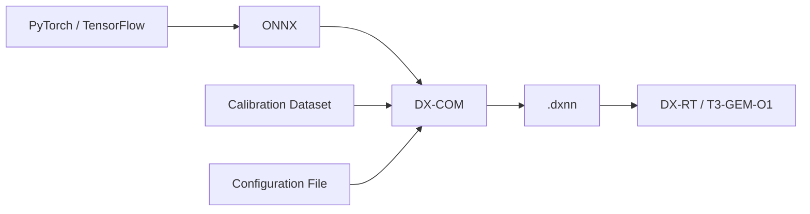

The DX-M1 accelerator cannot directly run models trained with frameworks such as PyTorch or TensorFlow. The
models must first be exported to the ONNX format and then converted with the **DX-COM** compiler into the
`.dxnn` format that can run on the NPU.



<Warning>
Since the compilation process requires intensive computation, it must be performed on a Linux computer with
an x86_64 architecture, not on the development board. The compiled `.dxnn` file must then be copied to the
board and run there.
</Warning>

## About Quantization

The NPU performs inference operations with INT8 precision. For this reason DX-COM converts the floating
point model weights into integers during compilation. During the conversion, a **calibration dataset**
consisting of real data is used so that the value ranges of the intermediate layers can be determined.

<Note>
The calibration dataset must consist of around 100 images selected from your training dataset and
representing the environment in which the model will run. Label information is not needed. A calibration set
with low representative power causes the accuracy of the model to drop more than expected.
</Note>

## Compilation Steps

<Steps>

  <Step title="Exporting the Model to the ONNX Format">

    Export the model you trained to the ONNX format. If you are using PyTorch, you can use the
    `torch.onnx.export` function.

    ```python
    import torch

    model.eval()
    dummy_input = torch.randn(1, 3, 640, 640)

    torch.onnx.export(
        model,
        dummy_input,
        "model.onnx",
        input_names=["input.1"],
        opset_version=13,
    )
    ```

    <Warning>
      The batch size of the input tensor must be `1`. DX-COM does not support compiling models that have a
      batch size greater than one.
    </Warning>
  </Step>

  <Step title="Preparing the Configuration File">

    A JSON file that tells the compiler the input format of the model, the calibration dataset and the
    pre-processing steps is prepared.

    ```json model_config.json
    {
      "inputs": {
        "input.1": [1, 3, 640, 640]
      },
      "calibration_num": 100,
      "calibration_method": "ema",
      "default_loader": {
        "dataset_path": "/datasets/calibration/",
        "file_extensions": ["jpeg", "jpg", "png"],
        "preprocessings": [
          { "convertColor": { "form": "BGR2RGB" } },
          { "resize": { "mode": "default", "width": 640, "height": 640 } },
          { "div": { "x": 255 } },
          { "transpose": { "axis": [2, 0, 1] } },
          { "expandDim": { "axis": 0 } }
        ]
      }
    }
    ```

    <ParamField body="inputs" required>
    The name and size of the input layer of the ONNX model. The input name in the ONNX model is written as
    the key, and the tensor size in the `[batch, channel, height, width]` format as the value.
    </ParamField>

    <ParamField body="calibration_num" default="100" required>
    The number of images to be used during quantization.
    </ParamField>

    <ParamField body="calibration_method" default="ema">
    The calibration method.
    </ParamField>

    <ParamField body="default_loader.dataset_path" required>
    The root directory in which the calibration dataset is located. The content of the directory is scanned
    including subdirectories.
    </ParamField>

    <ParamField body="default_loader.file_extensions" required>
    The image file extensions to be scanned.
    </ParamField>

    <ParamField body="default_loader.preprocessings" required>
    The pre-processing steps that the images will go through before being given to the model. These steps
    must be exactly the same as the pre-processing you applied during training.
    </ParamField>

    <Warning>
      The pre-processing steps being different from the ones used during training causes the model to
      produce incorrect results on the board even if the compilation is successful.
    </Warning>
  </Step>

  <Step title="Compiling the Model">

    Start the compilation process with the model and configuration file you prepared.

    ```bash
    dx_com -m model.onnx -c model_config.json -o ./output
    ```

    <ParamField body="-m, --model_path" required>
    The path of the ONNX model file.
    </ParamField>

    <ParamField body="-c, --config_path" required>
    The path of the configuration file (`*.json`).
    </ParamField>

    <ParamField body="-o, --output_dir" required>
    The directory in which the compiled model will be saved.
    </ParamField>

    <ParamField body="--shrink">
    Produces only the files required for running on the NPU as output. It reduces the model size.
    </ParamField>

    When the process is completed, a model file with the `.dxnn` extension is created in the directory you
    specified.
  </Step>

  <Step title="Transferring the Model to the Board">

    Copy the compiled model file to the development board.

    ```bash
    scp ./output/model.dxnn gemstone@t3-gem-o1:/home/gemstone/
    ```

    Verify the validity and the performance of the model on the board.

    ```bash
    run_model -m model.dxnn -b -l 100 -v
    ```
  </Step>

</Steps>

## Using Pre-compiled Models

If you do not want to compile your own model, you can use the pre-compiled models from the
[DX Model Zoo](https://github.com/DEEPX-AI/dx-modelzoo) repository provided by DEEPX. The repository
contains ready-to-use models for tasks such as image classification, object detection, segmentation and face
recognition.

The model repository is managed with the `dxmz` command line tool.

```bash
# Lists the available models
dxmz list

# Displays the details of the specified model
dxmz info ResNet18

# Compiles the model
dxmz compile ResNet18

# Measures the accuracy of the compiled model on a dataset
dxmz eval ResNet18 --dxnn ./ResNet18.dxnn --data_dir ./datasets/ILSVRC2012/val
```

## Exporting Ultralytics YOLO Models

If you are using YOLO family models, the Ultralytics library performs the ONNX export and compilation steps
with a single command.

```python
from ultralytics import YOLO

model = YOLO("yolo11n.pt")
model.export(format="deepx")
```

The directory created as a result of the command contains the `.dxnn` model file along with the
configuration and metadata files.

<Note>
Since the export process includes the quantization step, it must be performed on a Linux computer with an
x86_64 architecture. The resulting model file can be run on devices with both x86_64 and ARM64
architectures.
</Note>
