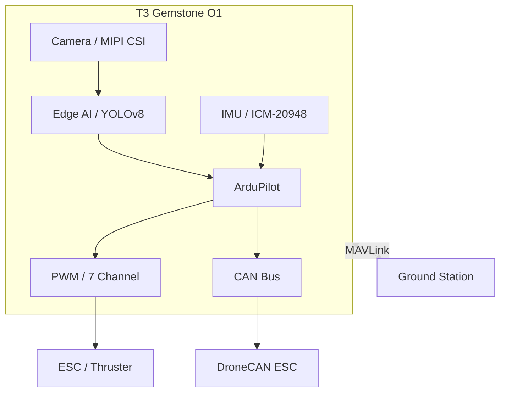

## 1. Overview

The [Teknofest Unmanned Underwater Systems Competition (ISUSY)](https://www.teknofest.org/en/competitions/unmanned-underwater-systems-competition/)
is a national competition covering the design, manufacturing, and testing processes of underwater
vehicles (ROV/AUV) capable of remote-controlled and/or autonomous mission execution.

The T3 Gemstone O1 development board offers an end-to-end platform for this competition with its powerful
processing capacity, onboard sensors, Edge AI accelerator, and ArduPilot support.

## 2. Competition Platform with T3 Gemstone O1

The T3 Gemstone O1 provides all the essential capabilities required for developing ROVs
(Remotely Operated Vehicles) and AUVs (Autonomous Underwater Vehicles) on a single board.

### 2.1. Underwater Vehicle Control with ArduPilot

The [ArduPilot](/en/projects/ardupilot) package pre-installed on the T3 Gemstone O1 includes ArduSub, a
tool specifically developed for underwater vehicles. Critical functions such as stabilization,
depth holding, and autonomous mission planning are provided directly through this layer.

<Warning>
  Only one ArduPilot vehicle service can be active at a time.
  Ensure all services except ArduSub are disabled for the underwater vehicle.
</Warning>

### 2.2. Underwater Object Detection with Edge AI

The 4 TOPS artificial intelligence accelerator of the T3 Gemstone O1 provides sufficient processing power for
real-time object detection on underwater camera feeds. Typical AI requirements for common tasks in
competition scenarios are:

| Task  | Required Processing Power |
| ----- | ------------------------- |
| Object detection (YOLOv8s, underwater obstacle detection) | 1-2 TOPS |
| Color/shape-based target recognition | 0.5 - 1 TOPS |
| Depth estimation (mono camera) | 1.5 - 2 TOPS |

These models can be compiled and loaded onto the T3 Gemstone O1 using the TI EdgeAI toolchain described
in the [Edge AI section](/en/boards/o1/ai/introduction).

### 2.3. Underwater Imaging with MIPI CSI Camera

The board's two 4-lane MIPI CSI ports provide a direct interface for underwater camera modules. Common
camera modules like the Raspberry Pi Camera V2 are compatible with the T3 Gemstone O1.
The camera feed can be integrated with both the ArduSub imaging system and the Edge AI pipeline.

Refer to the [Camera](/en/boards/o1/peripherals/camera) page for camera configuration.

### 2.4. Thruster Control with PWM

The 7 hardware PWM channels available on the T3 Gemstone O1's 40-pin GPIO header can be used to
generate ESC (Electronic Speed Controller) signals for thrusters like the BlueRobotics T200 or similar.
This allows the board to control thrusters both through ArduSub and directly from Python/C applications.

Refer to the [PWM](/en/boards/o1/peripherals/pwm) page for PWM configuration.

### 2.5. ESC Communication with CAN Bus

The board's TCAN1462-Q1 CAN FD transceiver offers integration capability with smart ESCs supporting
the UAVCAN/DroneCAN protocol. This allows thruster telemetry (current, speed, temperature) to be
read directly through ArduSub.

Refer to the [CAN Bus](/en/boards/o1/peripherals/canbus) page for CAN Bus configuration.

### 2.6. Vehicle Orientation and Stability Control with IMU

The board's onboard ICM-20948 sensor (accelerometer + gyroscope + magnetometer) is used directly by ArduSub
to measure the vehicle's orientation (pitch, roll, yaw) underwater. This enables stabilization
and depth-holding functions without the need for an external IMU module.

For more information about the IMU, refer to the [IMU](/en/boards/o1/peripherals/imu) page.

### 2.7. Real-Time Mission Execution

Task scheduling is critical in underwater vehicles. The T3 Gemstone O1 gains deterministic latency
characteristics with the PREEMPT-RT Linux patch. This ensures consistent timing, especially in
autonomous diving missions and sensor reading loops.

Refer to the [PREEMPT-RT](/en/projects/preempt-rt) page for real-time Linux installation.

### 2.8. Ground Station Connection

ArduPilot can work with various ground control software using the MAVLink protocol. The board streams
MAVLink over USB Ethernet; Wi-Fi (802.11n) or an external telemetry radio module can be used for
wireless connectivity.

| Software | Platform | Feature |
| -------- | -------- | ------- |
| [QGroundControl](https://qgroundcontrol.com/) | Windows, Linux, macOS, Android, iOS | Easy to use, mobile support |
| [Mission Planner](https://ardupilot.org/planner/) | Windows | Advanced parameter and mission editor |
| [MAVProxy](https://ardupilot.org/mavproxy/) | Linux, macOS | Command line, multi-connection routing |
| Custom Application | Any | Can be written from scratch in Python with [pymavlink](https://github.com/ArduPilot/pymavlink) |

## 3. Example System Architecture

The diagram below outlines the core components and data flow of a T3 Gemstone O1 based ROV.
Camera imagery is processed in the Edge AI layer and transmitted to ArduPilot along with IMU data;
ArduPilot then manages the thrusters via PWM and CAN Bus. The ground station communicates using the
MAVLink protocol.

## 4. Technical References

<CardGroup cols={2}>
  <Card title="Board Specifications" icon="microchip" href="/en/boards/o1/introduction">
    TI AM67A processor, 4GB RAM, 32GB eMMC, full list of sensors and interfaces
  </Card>
  
  <Card title="ArduPilot" icon="drone" href="/en/projects/ardupilot">
    ArduPilot setup guide, PWM pinout table, and QGroundControl connection
  </Card>
  
  <Card title="Edge AI" icon="microchip-ai" href="/en/boards/o1/ai/introduction">
    4 TOPS AI accelerator, model compilation, and object detection pipeline
  </Card>
  
  <Card title="Real-Time Linux" icon="clock" href="/en/projects/preempt-rt">
    Deterministic scheduling with the PREEMPT-RT patch
  </Card>
</CardGroup>

## 5. Useful Links

- [Teknofest UUS Competition Page](https://www.teknofest.org/en/competitions/unmanned-underwater-systems-competition/)
- [ArduPilot Documentation](/en/projects/ardupilot)
- [ArduSub Documentation](https://www.ardusub.com/)
- [QGroundControl Download](https://qgroundcontrol.com/)
- [BlueRobotics (Thruster and ESC)](https://bluerobotics.com/)
- [T3 Gemstone Community Forum](https://community.t3gemstone.org/)
