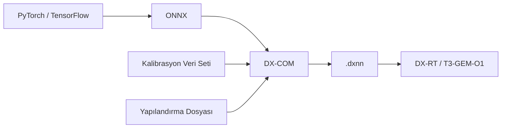

DX-M1 hızlandırıcısı, PyTorch veya TensorFlow gibi çerçevelerle eğitilmiş modelleri doğrudan
çalıştıramamaktadır. Modellerin öncelikle ONNX formatına aktarılması, ardından **DX-COM** derleyicisi ile
NPU üzerinde çalışabilen `.dxnn` formatına dönüştürülmesi gerekmektedir.



<Warning>
Derleme işlemi yoğun hesaplama gerektirdiğinden geliştirme kartı üzerinde değil, x86_64 mimarisine sahip
bir Linux bilgisayarda gerçekleştirilmelidir. Derlenen `.dxnn` dosyası daha sonra karta kopyalanarak
çalıştırılmalıdır.
</Warning>

## Niceleme (Quantization) Hakkında

NPU, çıkarım işlemlerini INT8 hassasiyetinde gerçekleştirmektedir. Bu nedenle DX-COM, derleme sırasında
kayan noktalı (float) model ağırlıklarını tam sayıya dönüştürmektedir. Dönüşüm sırasında ara katmanların
değer aralıklarının belirlenebilmesi için gerçek verilerden oluşan bir **kalibrasyon veri seti**
kullanılmaktadır.

<Note>
Kalibrasyon veri seti, eğitim veri setinizden seçilmiş ve modelin çalışacağı ortamı temsil eden 100 civarı
görüntüden oluşmalıdır. Etiket bilgisine ihtiyaç duyulmamaktadır. Temsil gücü düşük bir kalibrasyon seti,
modelin doğruluğunun beklenenden fazla düşmesine neden olmaktadır.
</Note>

## Derleme Adımları

<Steps>

  <Step title="Modelin ONNX Formatına Aktarılması">

    Eğittiğiniz modeli ONNX formatına aktarınız. PyTorch kullanıyorsanız `torch.onnx.export` fonksiyonunu
    kullanabilirsiniz.

    ```python
    import torch

    model.eval()
    dummy_input = torch.randn(1, 3, 640, 640)

    torch.onnx.export(
        model,
        dummy_input,
        "model.onnx",
        input_names=["input.1"],
        opset_version=13,
    )
    ```

    <Warning>
      Girdi tensörünün yığın boyutu (batch size) mutlaka `1` olmalıdır. DX-COM, birden fazla yığın boyutuna
      sahip modelleri derlemeyi desteklememektedir.
    </Warning>
  </Step>

  <Step title="Yapılandırma Dosyasının Hazırlanması">

    Derleyiciye modelin girdi biçimini, kalibrasyon veri setini ve ön işleme adımlarını bildiren bir JSON
    dosyası hazırlanmaktadır.

    ```json model_config.json
    {
      "inputs": {
        "input.1": [1, 3, 640, 640]
      },
      "calibration_num": 100,
      "calibration_method": "ema",
      "default_loader": {
        "dataset_path": "/datasets/calibration/",
        "file_extensions": ["jpeg", "jpg", "png"],
        "preprocessings": [
          { "convertColor": { "form": "BGR2RGB" } },
          { "resize": { "mode": "default", "width": 640, "height": 640 } },
          { "div": { "x": 255 } },
          { "transpose": { "axis": [2, 0, 1] } },
          { "expandDim": { "axis": 0 } }
        ]
      }
    }
    ```

    <ParamField body="inputs" required>
    ONNX modelinin girdi katmanı adı ve boyutu. Anahtar olarak ONNX modelindeki girdi adı, değer olarak
    `[yığın, kanal, yükseklik, genişlik]` biçiminde tensör boyutu yazılmaktadır.
    </ParamField>

    <ParamField body="calibration_num" default="100" required>
    Niceleme sırasında kullanılacak görüntü sayısı.
    </ParamField>

    <ParamField body="calibration_method" default="ema">
    Kalibrasyon yöntemi.
    </ParamField>

    <ParamField body="default_loader.dataset_path" required>
    Kalibrasyon veri setinin bulunduğu kök klasör. Klasör içeriği alt klasörler dahil taranmaktadır.
    </ParamField>

    <ParamField body="default_loader.file_extensions" required>
    Taranacak görüntü dosyası uzantıları.
    </ParamField>

    <ParamField body="default_loader.preprocessings" required>
    Görüntülerin modele verilmeden önce geçireceği ön işleme adımları. Bu adımlar, eğitim sırasında
    uyguladığınız ön işleme ile birebir aynı olmalıdır.
    </ParamField>

    <Warning>
      Ön işleme adımlarının eğitim sırasında kullanılanlardan farklı olması, derleme başarılı olsa bile
      modelin kart üzerinde hatalı sonuç üretmesine neden olmaktadır.
    </Warning>
  </Step>

  <Step title="Modelin Derlenmesi">

    Hazırladığınız model ve yapılandırma dosyası ile derleme işlemini başlatınız.

    ```bash
    dx_com -m model.onnx -c model_config.json -o ./output
    ```

    <ParamField body="-m, --model_path" required>
    ONNX model dosyasının yolu.
    </ParamField>

    <ParamField body="-c, --config_path" required>
    Yapılandırma dosyasının (`*.json`) yolu.
    </ParamField>

    <ParamField body="-o, --output_dir" required>
    Derlenmiş modelin kaydedileceği klasör.
    </ParamField>

    <ParamField body="--shrink">
    Çıktı olarak yalnızca NPU üzerinde çalıştırma için gereken dosyaları üretir. Model boyutunu küçültür.
    </ParamField>

    İşlem tamamlandığında belirttiğiniz klasörde `.dxnn` uzantılı model dosyası oluşturulmaktadır.
  </Step>

  <Step title="Modelin Karta Aktarılması">

    Derlenen model dosyasını geliştirme kartına kopyalayınız.

    ```bash
    scp ./output/model.dxnn gemstone@t3-gem-o1:/home/gemstone/
    ```

    Kart üzerinde modelin geçerliliğini ve performansını doğrulayınız.

    ```bash
    run_model -m model.dxnn -b -l 100 -v
    ```
  </Step>

</Steps>

## Hazır Modellerin Kullanılması

Kendi modelinizi derlemek istemiyorsanız, DEEPX tarafından sağlanan
[DX Model Zoo](https://github.com/DEEPX-AI/dx-modelzoo) deposundan önceden derlenmiş modelleri
kullanabilirsiniz. Depo; görüntü sınıflandırma, nesne tespiti, segmentasyon ve yüz tanıma gibi görevler için
hazır modeller içermektedir.

Model deposu, `dxmz` komut satırı aracı ile yönetilmektedir.

```bash
# Kullanılabilir modelleri listeler
dxmz list

# Belirtilen modele ait ayrıntıları görüntüler
dxmz info ResNet18

# Modeli derler
dxmz compile ResNet18

# Derlenmiş modelin doğruluğunu veri seti üzerinde ölçer
dxmz eval ResNet18 --dxnn ./ResNet18.dxnn --data_dir ./datasets/ILSVRC2012/val
```

## Ultralytics YOLO Modellerinin Aktarılması

YOLO ailesi modellerini kullanıyorsanız, Ultralytics kütüphanesi ONNX'e aktarma ve derleme adımlarını tek
bir komutta gerçekleştirmektedir.

```python
from ultralytics import YOLO

model = YOLO("yolo11n.pt")
model.export(format="deepx")
```

Komut sonucunda oluşturulan klasör içerisinde `.dxnn` model dosyası ile yapılandırma ve üst veri dosyaları
yer almaktadır.

<Note>
Aktarma işlemi niceleme adımını içerdiğinden x86_64 mimarisine sahip bir Linux bilgisayarda
gerçekleştirilmelidir. Oluşan model dosyası hem x86_64 hem de ARM64 mimarisindeki cihazlarda
çalıştırılabilmektedir.
</Note>
