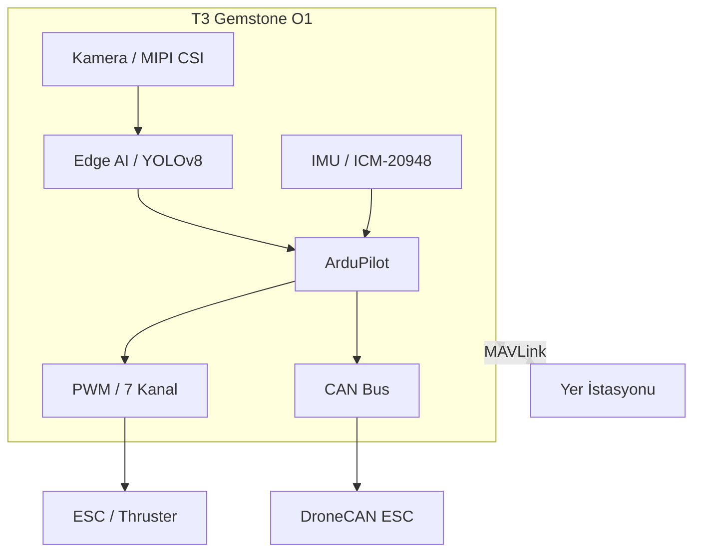

## 1. Genel Bakış

[Teknofest İnsansız Su Altı Sistemleri Yarışması (İSUSY)](https://www.teknofest.org/tr/yarismalar/insansiz-su-alti-sistemleri-yarismasi/),
uzaktan kumandalı ve/veya otonom görev icra edebilen su altı araçlarının (ROV/AUV) tasarım, üretim ve test
süreçlerini kapsayan ulusal bir yarışmadır. T3 Gemstone O1 geliştirme kartı; güçlü işlem kapasitesi, yerleşik sensörleri,
Edge AI hızlandırıcısı ve ArduPilot desteğiyle bu yarışma için uçtan uca bir platform sunmaktadır.

## 2. T3 Gemstone O1 ile Yarışma Platformu

T3 Gemstone O1, ROV (Remotely Operated Vehicle) ve AUV (Autonomous Underwater Vehicle) geliştirmek için
gereken tüm temel yetenekleri tek bir kartta sunar.

### 2.1. ArduPilot ile Su Altı Araç Kontrolü

T3 Gemstone O1'de halihazırda kurulu gelen [ArduPilot](/tr/projects/ardupilot) paketi, su altı araçları için
özel olarak geliştirilmiş ArduSub aracını içerir. Stabilizasyon, derinlik tutma ve otonom görev planlaması
gibi kritik işlevler doğrudan bu katman üzerinden sağlanır.

<Warning>
Aynı anda yalnızca bir ArduPilot araç servisi etkinleştirilebilir.
Su altı aracı için ArduSub dışındaki tüm servislerin devre dışı olduğundan emin olun.
</Warning>

### 2.2. Edge AI ile Su Altı Nesne Tespiti

T3 Gemstone O1'in 4 TOPS kapasiteli yapay zeka hızlandırıcısı, su altı kamerası görüntüleri üzerinde gerçek zamanlı
nesne tespiti yapmaya yetecek işlem gücünü sağlar. Yarışma senaryolarında sıklıkla karşılaşılan görevler için
tipik AI gereksinimleri:

| Görev | Gereken İşlem Gücü |
|-------|--------------------|
| Nesne tespiti (YOLOv8s, su altı engel algılama) | 1–2 TOPS |
| Renk/şekil tabanlı hedef tanıma | 0.5–1 TOPS |
| Derinlik tahmini (mono kamera) | 1.5–2 TOPS |

Bu modeller, [Edge AI bölümünde](/tr/boards/o1/ai/introduction) anlatılan TI EdgeAI araç zinciri ile
T3 Gemstone O1'e derlenerek yüklenebilir.

### 2.3. MIPI CSI Kamera ile Su Altı Görüntüleme

Kartın iki adet 4-lane MIPI CSI portu, su altı kamera modülleri için doğrudan arayüz sağlar. Raspberry Pi
Kamera V2 gibi yaygın kamera modülleri T3 Gemstone O1 ile uyumludur. Kamera akışı hem ArduSub'ın görüntü sistemiyle
hem de Edge AI pipeline'ıyla entegre edilebilir.

Kamera yapılandırması için [Kamera](/tr/boards/o1/peripherals/camera) sayfasına bakınız.

### 2.4. PWM ile Thruster Kontrolü

T3 Gemstone O1'in 40-pin GPIO başlığında bulunan 7 adet donanımsal PWM kanalı, BlueRobotics T200 veya benzeri
thruster'lar için ESC (Electronic Speed Controller) sinyalleri üretmek amacıyla kullanılabilir. Bu sayede
kart, hem ArduSub üzerinden hem de doğrudan Python/C uygulamalarından thruster'ları kontrol edebilir.

PWM yapılandırması için [PWM](/tr/boards/o1/peripherals/pwm) sayfasına bakınız.

### 2.5. CAN Bus ile ESC Haberleşmesi

Kartın TCAN1462-Q1 CAN FD dönüştürücüsü, UAVCAN/DroneCAN protokolünü destekleyen akıllı ESC'lerle
entegrasyon imkânı sunar. Bu sayede thruster telemetrisi (akım, hız, sıcaklık) doğrudan ArduSub üzerinden
okunabilir.

CAN Bus yapılandırması için [CAN Bus](/tr/boards/o1/peripherals/canbus) sayfasına bakınız.

### 2.6. IMU ile Araç Yönelim ve Denge Kontrolü

Kartın yerleşik ICM-20948 sensörü (ivmeölçer + jiroskop + manyetometre), ArduSub tarafından aracın
su altındaki yönelimini (pitch, roll, yaw) ölçmek için doğrudan kullanılır. Bu sayede harici bir IMU
modülüne gerek kalmadan stabilizasyon ve derinlik tutma fonksiyonları sağlanır.

IMU hakkında daha fazla bilgi için [IMU](/tr/boards/o1/peripherals/imu) sayfasına bakınız.

### 2.7. Gerçek Zamanlı Görev İcrası

Su altı araçlarında görev zamanlaması kritik öneme sahiptir. T3 Gemstone O1, PREEMPT-RT Linux yaması ile
deterministic (belirleyici) gecikme özelliği kazanır. Bu özellikle otonom dalış görevlerinde ve sensör
okuma döngülerinde tutarlı zamanlama sağlar.

Gerçek zamanlı Linux kurulumu için [PREEMPT-RT](/tr/projects/preempt-rt) sayfasına bakınız.

### 2.8. Yer İstasyonu Bağlantısı

ArduPilot, MAVLink protokolü üzerinden çeşitli yer kontrol yazılımlarıyla çalışabilir. Kart USB Ethernet
üzerinden MAVLink yayını yapar; kablosuz bağlantı için Wi-Fi (802.11n) veya harici telemetri radyo modülü
kullanılabilir.

| Yazılım | Platform | Özellik |
|---------|----------|---------|
| [QGroundControl](https://qgroundcontrol.com/) | Windows, Linux, macOS, Android, iOS | Kullanımı kolay, mobil destek |
| [Mission Planner](https://ardupilot.org/planner/) | Windows | Gelişmiş parametre ve görev editörü |
| [MAVProxy](https://ardupilot.org/mavproxy/) | Linux, macOS | Komut satırı, çoklu bağlantı yönlendirme |
| Özel uygulama | Herhangi | [pymavlink](https://github.com/ArduPilot/pymavlink) ile Python'da sıfırdan yazılabilir |

## 3. Örnek Sistem Mimarisi

Aşağıdaki diyagram, T3 Gemstone O1 tabanlı bir ROV'un temel bileşenlerini ve aralarındaki veri akışını özetlemektedir.
Kamera görüntüsü Edge AI katmanında işlenir, IMU verileriyle birlikte ArduPilot'a iletilir; ArduPilot ise PWM ve
CAN Bus üzerinden thruster'ları yönetir. Yer istasyonu MAVLink protokolüyle haberleşir.

## 4. Teknik Referanslar

<CardGroup cols={2}>
  <Card title="Kart Özellikleri" icon="microchip" href="/tr/boards/o1/introduction">
    TI AM67A işlemcisi, 4GB RAM, 32GB eMMC, sensörler ve arayüzlerin tam listesi
  </Card>
  <Card title="ArduPilot" icon="drone" href="/tr/projects/ardupilot">
    ArduPilot kurulum kılavuzu, PWM pinout tablosu ve QGroundControl bağlantısı
  </Card>
  <Card title="Edge AI" icon="microchip-ai" href="/tr/boards/o1/ai/introduction">
    4 TOPS AI hızlandırıcı, model derleme ve nesne tespiti pipeline'ı
  </Card>
  <Card title="Gerçek Zamanlı Linux" icon="clock" href="/tr/projects/preempt-rt">
    PREEMPT-RT yaması ile deterministic zamanlama
  </Card>
</CardGroup>

## 5. Yararlı Bağlantılar

- [Teknofest İSUSY Yarışma Sayfası](https://www.teknofest.org/tr/yarismalar/insansiz-su-alti-sistemleri-yarismasi/)
- [ArduPilot Dokümantasyonu](/tr/projects/ardupilot)
- [ArduSub Dokümantasyonu](https://www.ardusub.com/)
- [QGroundControl İndirme](https://qgroundcontrol.com/)
- [BlueRobotics (Thruster ve ESC)](https://bluerobotics.com/)
- [T3 Gemstone Topluluk Forumu](https://community.t3gemstone.org/)
